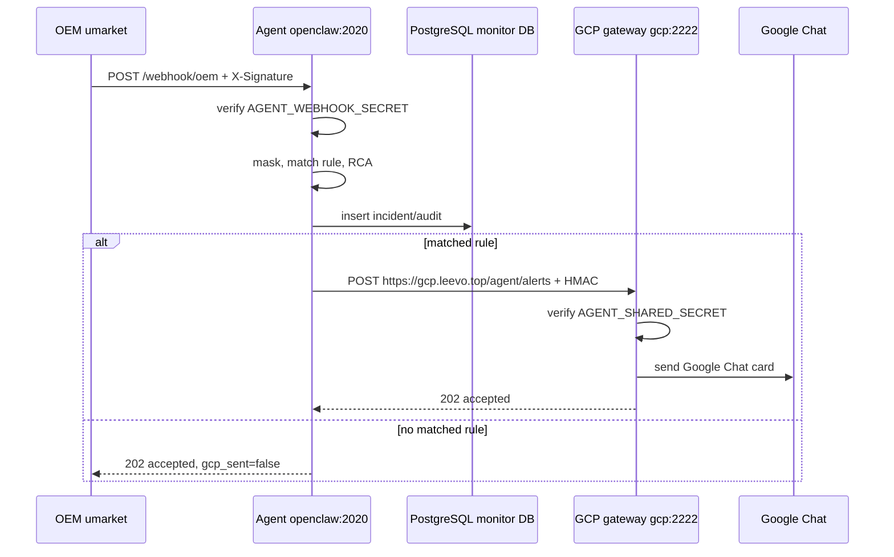
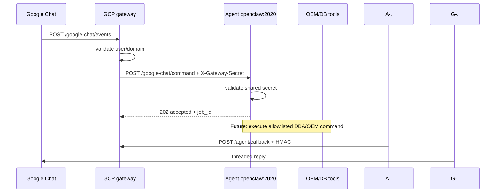

# Agent GCP Diagrams

## High-level architecture

```mermaid
flowchart LR
    OEM[OEM umarket\n10.10.10.112] -->|OS Command signed webhook| AGENT[Agent Monitor openclaw\n10.10.10.110:2020\n/u01/app/agent_monitor]
    AGENT -->|Processed alert + HMAC\nhttps://gcp.leevo.top/agent/alerts| GCP[GCP Gateway gcp\n10.10.10.113:2222\n/u01/app/ggchat_app]
    GCP -->|cardsV2/webhook| CHAT[Google Chat Space]
    CHAT -->|slash/message event| GCP
    GCP -->|POST /google-chat/command\nX-Gateway-Secret| AGENT
    AGENT -.future callback.->|POST /agent/callback| GCP
```

## Alert sequence



## Command sequence



## Runtime ports

| Host | Service | Port | Scope |
|---|---|---:|---|
| openclaw | `agent-monitor.service` | `2020` | Agent brain + dashboard |
| openclaw | old `monitor-v2-agent.service` | `8080` | disabled/inactive |
| gcp | `ggchat-app.service` | `2222` | local loopback Google Chat gateway |
| gcp | `cloudflared.service` | n/a | exposes `gcp.leevo.top` to app port 2222 |
```
